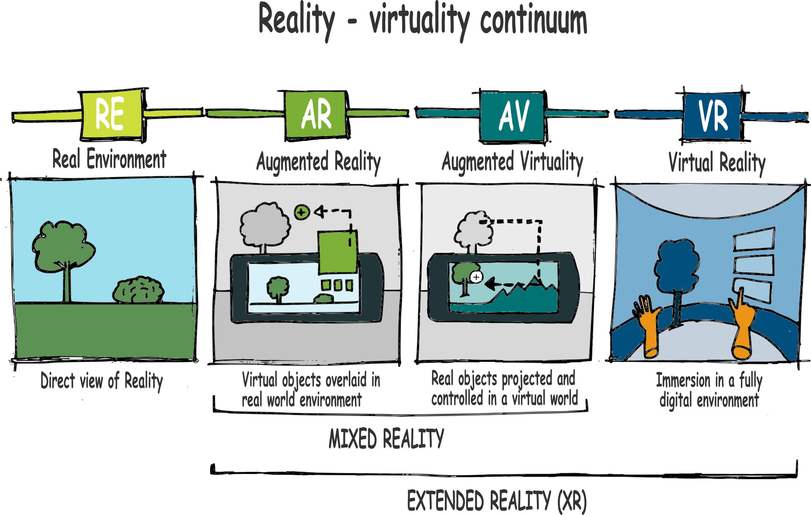

# What is Digital Reality?

This is an umbrella term. Digital reality (DR) is used as a general term for all type of immersive experiences, including virtual reality (VR), augmented reality (AR) , mixed reality (MR), and extended reality (XR). 
## Virtual Reality (VR)
In this book Virtual Reality means an immersive computer-simulated reality that creates a physical environment that does not exist. Virtual environments may resemble real places (such as a workshop area or a cockpit of a crane) or imagined ones (the deck of the Titanic for example), they are not in the current physical environment.

Figure 1-1 shows an example of a VR environment. It’s a screenshot of a professional painting simulator.

## Augmented Reality (AR)
On contrast, Augmented reality is a way of viewing the real world and adding extra content ( augmenting) to the real world visual.  The main difference between VR and AR is that AR modify the real visual instead of simulating a visual that do not exist in the current reality. 

Originally, in AR, the computer-generated content is an add on on a separate layer that does not communicate the real world content.  Now, however AR solutions tend to include interaction with the real world objects and this blended solution is often referred as mixed reality (MR). For the sake of simplicity we will refer augmented reality as an umbrella term that cover mixed reality too. 

Figure 1-2 shows an example of AR.

## Augmented Virtuality (AV)
Picture you are in a large, empty room. There is a bar across the room with a big jar of fresh beer on it. You then put on an head mount device to reveal an entirely new environment, but the table and beer are still visible. This is Augmented Virtuality.

## Mixed Reality (MR)
Have you seen the movie [Minority Report](https://www.imdb.com/title/tt0181689/)? If not, [click this link of the movie](https://www.youtube.com/watch?v=BmSarhudhiY) and watch the first half of the footage. In the movie the main character (played by Tom Cruise) is a special investigator using mixed reality tools to collect and analyse scene information of a possible crime scene. His colleague wears special glasses that allows him see the reality mixed with the artifical reality. On the footage you see the main character standing in the front of holographic screens using a special gloves to interact with the projected reality.  
MR blurs the boundaries between real and virtual interaction. It is a blend of physical and digital worlds, unlocking natural and intuitive 3D human, computer, and environment interactions.

Here you can see a still from the Minority Report

## Reality - Virtuality continuum

To sum it up, from reality to full immersive virtuality there are 4 different stages of Virtuality. Real environment is depicted on the left, then you see Augmented reality where virtual objects are projected onto the picture of real environment. Augmented virtuality is somewhat an inverse of AR, because pictures of real objects are picked and taken into a virtual world. And finally, in Virtual reality your eyes and ears are tricked to give you the impression of a fully artificial world. 

Figure 1-3 shows the entire reality - virtual reality continuum

