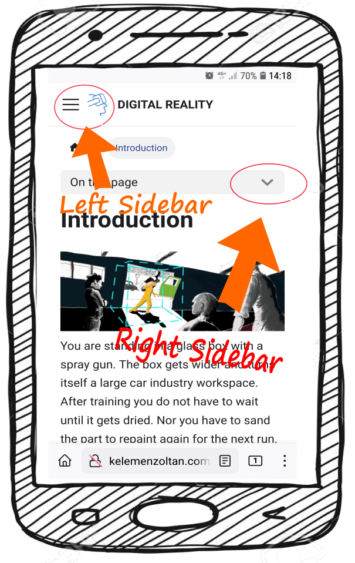

# Introduction

"Ageing affects every aspect of our lives, throughout our lives. As the current pandemic continues to challenge us, and as we fight to protect lives and livelihoods, we must not lose sight of a remarkable development: never before have so many Europeans enjoyed such long lives. This is a major achievement that is underpinned by the EU’s social market economy.

<<<<<<< HEAD
```mdx-code-block
import Tabs from '@theme/Tabs';
import TabItem from '@theme/TabItem';
```


You are standing in a glass box with a spray gun and paint. The box gets wider and turns itself a large car industry workspace. After training you do not have to wait until it gets dried.

You are in front of a flat screen following a path with your welding torch and the training tool will follow your hand very precisely. Before this tool, nobody could improve motor skills so fast and accurately.

We find ourselves in a rapidly emerging technology field. Virtual Reality headsets, fast and reliable devices do the magic: you feel as if you were there.  More importantly, it is precise. Educational simulations are developed to follow very tiny movements of your fingers to proceed medical operations, they teach maneuvering large cargo ships, help memorizing safety protocols, driving vehicles in terrains in deep forests or handling construction cranes even in strong wind at 200 meters from the ground with high fidelity. 

And it is getting cheaper each year.

This is a good news in vocational training. The high tech high precision learning is not a privilege of astronauts anymore.  

## About this handbook

This Handbook on Digital Reality in Vocational Education (DR in VET) is dedicated to teachers, trainers and decision makers in vocational education systems, to help to get familiar with digital reality tools and systems. Also, the book is dedicated to the young generation breaking new ways in teaching and learning. 

We wrote this book for you because we'd like to : 

* show you how simulators and other devices can broaden the horizon
* Introduce the wide range of digital reality solutions
* tips on how to choose the most appropriate solution.
* offer tips new ideas to make learning delightful and funny 
* Guidelines for teaching with these tools.

:::info Immersive technologies are supportive
Please bear in mind that immersive technologies are complements not substitutes. They help and support by avoiding health risks, reducing costs, gamifying content or improving learning efficacy. Never a beginner can really fly an Jumbo Jet after trainings in a flight simulator!
:::

## Assumptions


Before we dive into the world of Digital Reality, we should say a few words about reality in vocational education. Some training centers are well equipped and have numerous well trained Digital Instructors. Most of them, however, are far from being aware of the whole range of opportunities digital realities offer. To be realistic, we assume you may work in a school with a centralized educational system with limited influence and resources. We detail [typical situations](Digital%20Reality%20in%20VET/Obstacles%20in%20the%20organization) in the chapter "Obstacles in the organization".

We assume that you as a teacher have at least a passing familiarity with Virtual Reality (VR),  Augmented Reality (AR). You may have heard the terms or seen someone trying out a VR experience at a mall or retailer. We assume that you have a cursory knowledge of using learning management software (LMS) such as Moodle, or Google Classroom. You use or are aware of social media such as Facebook or Instagram. You used or saw using videoconferencing tools like Zoom or Microsoft Teams. You are capable to install, run applications on smartphones and personal computers (PCs). And at last but not at least, you are interested in new teaching methodologies the digital world offers.

We have assumptions about your students. We think, your students may fall into these broad categories:

* Youngsters (14  to 22 or so)
* Adults who are obliged (or want) to refresh their skills
    They may have very different background coupled with numerous attitudes:
* Lowest social status with no support and lack of motivation. They come because they did not find anything suitable. 
* Low but not very low social status with a remarkable support to break out. Gifted students with help of teachers or parents for example.
* High social status with strong commitment. For example, coming from a traditional crafting or artist family, or,  as an adult, choosing a second career path.  

And our last assumption is that the education or training process usually lasts three years which is taken mainly in a dual system.

## How we organized this book


This is a handbook, planned to look up things in it occasionally.  We list ideas, how-tos, tips and tricks and best practices, hoping that the topics we cover will help you and your students to improve and be happy with their career. We also assume a relevance order on what you may be interested most. That is why topics related to Augmented Reality and Virtual Reality are discussed here rather than than LMSes and videoconferencing. We would like to push the scope of this handbook beyond technologies and pedagogical guidelines, therefore we devoted parts for choosing and implementing these technologies knowing that introducing new things may shake the organization you work for.

### Sidebars

**<--** The left sidebar will show you the structure of the chapters. If you click on the ```>``` sign next to a title the roll-down menu will show you the sub-chapters underneath. If you click on the sign again, it will roll up and close.
=======
In the last five decades, life expectancy at birth has increased by about 10 years for both men and women. The demographic profiles of EU regions vary widely, notably between urban and rural areas, with some places ageing significantly and others expanding their working-age population. Europe is by no means the only continent with an ageing population, but the process is most advanced here. As way of illustration, today’s median age in Europe1 of 42.5 years is more than double the figure for Africa. This gap will remain large in the coming decades.

This trend is having a significant impact on people’s everyday lives and on our societies. It has implications for economic growth, fiscal sustainability, health and long-term care, well-being and social cohesion. In addition, the pandemic’s disproportionate impact on older people – in terms of hospitalisations and deaths - has highlighted some of the challenges an ageing population poses on health and social care. But ageing also provides new opportunities for creating new jobs, fostering social fairness and boosting prosperity, for instance in the ‘silver’ and care economies." (Green Paper on Ageing, Brussels, 2021)

## About this collection
This collection on "Inactivity is not an option" is dedicated to teachers, trainers social workers and volunteers. We provide best practices exercises articles and other useful materials.  Also, the book is dedicated to the young generation breaking new ways in social work. 

We wrote this book for you because we'd like to : 

* highlight the importance of social inclusion
* Introduce the wide range existing practices in Europe
* offer tips new ideas to make the job delightful and funny 
* Guidelines for applying these tools and practices.

## How we organized this collection

This is a collection, planned to look up things in it occasionally.  We list ideas, how-tos, tips and tricks and best practices. We put materials to browse and there is no specific order. The big chunks of the material is Articles, Best Practices, Games, Exercises, and Sites as you can see on the left sidebar.

### Sidebars

**<--** The left sidebar will show you the structure of the chapters. If you click on the ```>``` sign next to a title the roll down menu will show you the sub-chapters underneath. If you click on the sign again, it will roll up and close.
>>>>>>> d6ed69407996172c60bc656c1266cfdf938f8dcc

The right sidebar is for navigating within one block as you can see now **-->**  

:::info Sidebars on mobiles
<<<<<<< HEAD
If you are reading this on a smartphone or a tablet you find the sidebars on the top of the page as the screenshot depicts below.
:::

=======

If you are reading this on a smartphone or a tablet you find the sidebars on the top of the page.

:::


>>>>>>> d6ed69407996172c60bc656c1266cfdf938f8dcc


### Signs
:::note
We highlight some **content** with this notification sign if recommended for your interest. Further readings for example..
:::

:::tip

We use this if we suggest tips and tricks.

:::

:::info

This is for simple information (FYI) if we are bored using the two above.

:::


<<<<<<< HEAD
We use C A U T I O N for some **content** if something crucial to remember (organising issues with simulators for example).

:::

:::danger

Some **content** will be highlighted with this strange red to draw your attention to health risk or other kind of dangers.

:::

### accordions
There are information that will be too long for one page. That is why sometimes we use **accordions** in  the text. accordions contains information hidden under a short summary and you can click on them to reveal the content. If you click again the hidden content disappears. Try it below.
<details><summary>CLICK ME - can be followed by a short summary  like this... </summary>
<p>
Click on the fruit names to see how to change between tabs

<Tabs>
  <TabItem value="apple" label="Apple" default>
    How about an apple? 🍎
  </TabItem>
  <TabItem value="orange" label="Orange">
    Or an orange instead? 🍊
  </TabItem>
  <TabItem value="banana" label="Banana">
    Or you prefer a banana? 🍌
  </TabItem>
</Tabs>

<p></p>

#### Content title

And a kind of information that may be interesting.

</p>
</details>

### Tabs
You will see sometimes tabs in the text just like in the accordion above. We use them to ease the eye when sequential arrangement of information would make understanding difficult. Tabs usually used when you want to present the same thing in different versions or a subject in different state like a man before and after loosing weight. 


```mdx-code-block
<Tabs>
  <TabItem value="TAB 1" label="TAB 1" default>
    <p>🍌 This is what you see first. 🍌
    </p>
  </TabItem>
  <TabItem value="TAB2" label="TAB 2">
    <p>🍎 And that is what you see the second time.</p>
  </TabItem>
  <TabItem value="TAB3" label="TAB 3">
    <p>🍊 And finally,this is what you see the third time. 🍊</p>
    </TabItem>
</Tabs>
```


 
=======
>>>>>>> d6ed69407996172c60bc656c1266cfdf938f8dcc
